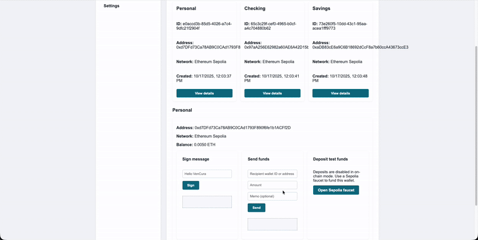

<div align="center">
  <p><h1 style="margin:0;">VenCura – Custodial Wallet Playground</h1></p>

  <p>
    VenCura is a tiny, realistic backend + UI that demonstrates how a custodial wallet platform could manage user accounts, generate wallets, and perform typical operations such as signing messages and sending transactions. The focus is on clear API design, basic security practices, and providing a realistic end-to-end flow that can be easily extended.
  </p>

  <p>
    
  </p>

  <p>
    <a href="https://nodejs.org/" target="_blank" rel="noreferrer noopener">
      
    </a>
    <a href="#license">
      
    </a>
    <a href="https://github.com/dynamic-labs/dynamic-take-home/actions/workflows/backend-tests.yml">
      
    </a>
    
  </p>
</div>

---

## Tech stack

- **Ethers.js v6** for key management, message signing, and on-chain transactions.
- **Node.js (ES modules)** for the API server.

## Getting started

```bash
# Install Node.js 18+ (v20 tested) and install dependencies
npm install

# Run the API + UI
npm start
# Visit http://127.0.0.1:3000

# During development (auto-reload)
npm run dev

# Run tests
npm test
```

Environment variables:

- `CHAIN_MODE` – `simulated` (default) keeps everything local; `sepolia` enables live on-chain flow.
- `SEPOLIA_RPC_URL` – HTTPS RPC endpoint to use when `CHAIN_MODE=sepolia` (defaults to the provided Infura URL).
- `KEY_ENCRYPTION_SECRET` – required secret used to encrypt wallet private keys at rest (minimum 32 characters). The service refuses to start if this is not set.

The server stores all data in Postgres.

## Security considerations

While the project is intentionally lightweight, the implementation keeps security in mind, organized by area:

### Authentication and sessions

- Passwords are hashed with memory-hard `Argon2id` and a per-user salt.
- Minimum password length of 8 characters is enforced at registration.
- Password verification uses constant‑time comparison to avoid timing leaks.
- Bearer tokens are required on protected routes via the `Authorization` header.
- Session tokens are 48-byte random values and are stored hashed (`SHA-256`) in the database.
- Only one active session per user is kept; logging in invalidates prior sessions. `last_seen_at` is updated per request.

### Key management and cryptography

- Wallet private keys never leave the backend and are never returned in API responses.
- Private keys are encrypted at rest with AES-256-GCM. The encryption key is derived from `KEY_ENCRYPTION_SECRET` using `scrypt` and each payload stores IV + auth tag with the ciphertext.
- The service refuses to start unless `KEY_ENCRYPTION_SECRET` is set to a high‑entropy value (min 32 chars; rejecting known weak defaults).

### Access control and data isolation

- Per-request authorization is enforced; wallet operations verify ownership and return `403` when the user does not own the wallet.
- Database constraints ensure uniqueness for user emails and wallet addresses, with foreign keys and `ON DELETE CASCADE` to avoid orphaned data.

### Transport, CORS, and API surface

- The UI communicates with the backend using bearer tokens; in production, serve strictly over HTTPS.
- CORS is intentionally permissive for the demo (`*` origin with preflight support). In production, restrict origins/headers/methods.

### Mode-specific behavior

- Two modes: `simulated` (local ledger) and `sepolia` (on-chain). Deposits are disabled in on-chain mode to avoid inconsistent balances.
- The JSON-RPC provider is only constructed and used in on-chain mode.

### Further hardening (out of scope for the take-home but recommended in production):

- Move encrypted keys into an HSM or dedicated key-management service.
- Replace the simple session model with signed JWTs or opaque tokens backed by a secure, expiring session store; add rotation/revocation.
- Add rate limiting, audit logging, and monitoring.
- Restrict CORS to trusted origins; if switching to cookies, use HttpOnly + SameSite and add CSRF protections.
- Rotate RPC credentials securely and add transaction status tracking.
- Introduce role-based access control (RBAC) for shared wallets and multi-user scenarios.


## Future enhancements

- Multi-account support per user with configurable account types.
- Shared wallets with invite flows.
- Transaction status polling and integration with on-chain explorers.
- Notifications or messaging (e.g., XMTP) for signed events.
- Replace the vanilla UI with a component library (React/Vue) once requirements grow.

## License

MIT © 2025 Agu Rodríguez. See `LICENSE` for details.
